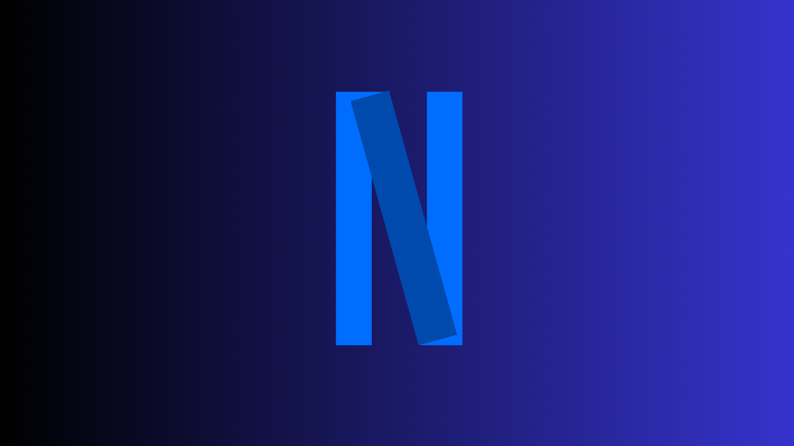
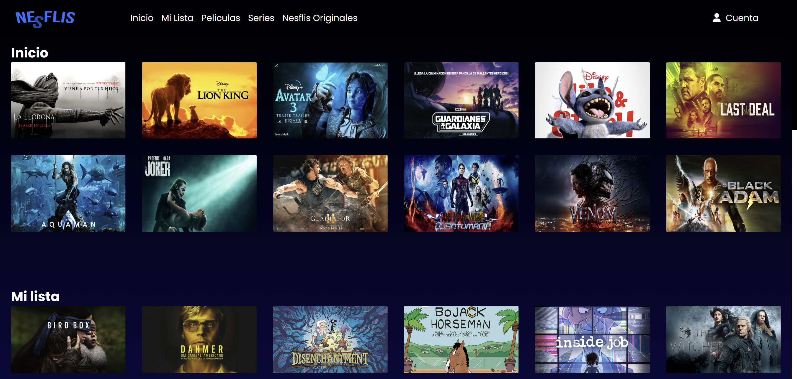

# Nesflis

Este proyecto es el frontend de la plataforma de streaming Nesflis, la cual consume una API REST desarrollada en Spring Boot. El frontend se encarga de la interfaz de usuario, permitiendo a los usuarios explorar, interactuar y gestionar contenido de películas y series de forma atractiva y funcional.

El frontend de Nesflis es una aplicación web desarrollada con las tecnologías de HTML, CSS y JavaScript. Esta interfaz interactúa con la API backend para proporcionar una experiencia de usuario fluida y dinámica, similar a otras plataformas de streaming populares.



## Tabla de contenido

| Index | Titulo |
| ------ | --------------- |
| 1. | Descripcion del Proyecto |
| 2. | Requrimientos del sistema |
| 3. | Instalación |
| 4. | Diagrama ER|
| 5. | FAQs|
| 6. | Licencia |
| 7. | Contacto |

# Requisitos del Sistema

Este proyecto está desarrollado utilizando las siguientes tecnologías:

- **HTML 5**  
  El estándar para estructurar las páginas web, proporcionando la semántica y el contenido básico de la aplicación.

- **CSS**  
  Usado para el estilo visual de la interfaz, asegurando que la aplicación sea atractiva y fácil de usar.

- **JavaScript**  
  Lenguaje de programación que permite la interactividad de la interfaz, realizando solicitudes a la API para obtener datos y actualizando el DOM de manera dinámica.

## Requisitos para Ejecutar el Proyecto

Para poder ejecutar este proyecto, asegúrate de tener instalados los siguientes requisitos en tu sistema:

- **VisualStudio**: [Descargar VisualStudio](https://code.visualstudio.com/download)

Puede ser cualquier editor de codigo que tengas

## Instalación

Clona el Proyecto

```bash
  git clone https://github.com/Stefanyyy15/NesflisFront.git
```

Ve al directorio del proyecto

```bash
  cd NesflisFront
```

Directo al archivo

```bash
  code .
```
## Pestañas





## FAQs
Lista de preguntas frecuentes:
1. ¿Cómo puedo contribuir al proyecto?
   _Puedes contribuir creando un fork del repositorio y enviando un pull request._

2. ¿Este proyecto está abierto a contribuciones?
   | Tipo de contribución | Aceptado | Comentarios |
   |:---------------------|:--------:|------------:|
   | Reporte de errores   | Sí       | Utiliza la sección de issues en GitHub |
   | Nuevas características| Sí      | Envía un pull request con tus propuestas |

## Licencia

Este proyecto está licenciado bajo la Licencia MIT. 

[](https://choosealicense.com/licenses/mit/)

## Contacto

Si tienes alguna pregunta o deseas más información, no dudes en contactarme:

- **Nombre**: Michelle
- **GitHub**: [https://github.com/miDaya02](https://github.com/miDaya02)

- **Nombre**: Luis
- **GitHub**: [https://github.com/L-Salamanca](https://github.com/L-Salamanca)

- **Nombre**: Stefany
- **GitHub**: [https://github.com/Stefanyyy15](https://github.com/Stefanyyy15)

---
